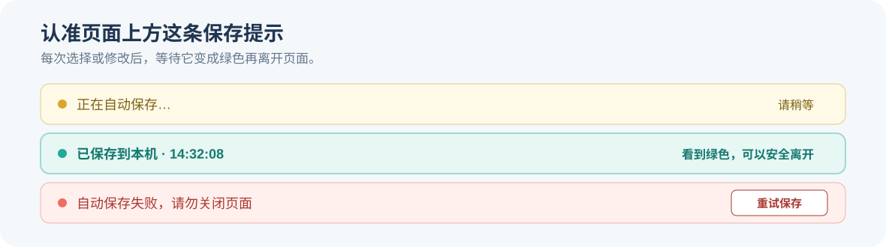

# DFEW 表情轨迹标注平台

你的工作分为两种：判断一张图片中的可见表情；观看同一视频抽取出的 16 张连续图片，并记录主要表情的强度变化。

## 你需要准备的三个东西

1. 本 GitHub 仓库 （clone本仓库的操作看下面第一次安装）；
2. Google Drive 中的 `clip_224x224_16f.zip`；
3. Google Drive 中的 `给R01的文件.zip` 或 `给R02的文件.zip`，**并解压**。（根据自己的编号选择下载）

[第2、3项 DFEW 图片下载](https://drive.google.com/drive/folders/1mRRRCAfaJg3haLbcooIyiJgfZV1VfSpE?usp=sharing)

**请保持压缩包原名，不要解压`clip_224x224_16f.zip`，也不要调整内部文件。**

## 第一次安装

### macOS

1. 从 [Python 官方网站](https://www.python.org/downloads/macos/) 安装 Python（如果还没有）。
2. 打开“终端”应用。
3. 逐行复制并运行下面三行：

```bash
cd ~/Documents
git clone https://github.com/JyBmegan/dfew-expression-trajectory-annotation.git
cd dfew-expression-trajectory-annotation
```

如果电脑提示尚未安装 Git，请按照弹出的系统提示完成安装，然后重新运行以上三行。

### Windows

1. 从 [Python 官方网站](https://www.python.org/downloads/) 安装 Python；安装时勾选 `Add Python to PATH`（如果还没有）。
2. 从 [Git 官方网站](https://git-scm.com/downloads/win) 安装 Git。
3. 打开 PowerShell，逐行运行：

```powershell
cd $HOME\Documents
git clone https://github.com/JyBmegan/dfew-expression-trajectory-annotation.git
cd dfew-expression-trajectory-annotation
```

运行完后，仓库应位于：

```text
你的个人文件夹/Documents/dfew-expression-trajectory-annotation/
```

## 放置图片和个人任务包

打开刚才下载的 `dfew-expression-trajectory-annotation` 文件夹（就是clone的当前repository）。

1. 在其中依次打开 `local_data` 和 `dfew`；如果 `dfew` 不存在，就新建这个文件夹（`dfew-expression-trajectory-annotation/local_data/dfew/`)。
2. 从 Google Drive 下载你自己的个人任务包，例如 给R01的文件.zip。
* 不要把这个 ZIP 原文件直接放进仓库。将 ZIP 解压到仓库文件夹本身，也就是 `dfew-expression-trajectory-annotation`这个文件夹下。
* 如果系统询问是否合并 `config` 或 `local_data` 文件夹，请选择“合并”或“是”，不要删除整个原文件夹。
* 个人任务包中的内容包括：
1) config/project.toml
2) local_data/study.sqlite
3) local_data/practice.sqlite
4) 你的账号与放置说明.txt
3. 把 Google Drive 下载的 `clip_224x224_16f.zip` 放到 `dfew-expression-trajectory-annotation/local_data/dfew/`（不要解压）。


**完成后请核对结构**：

```
dfew-expression-trajectory-annotation/
├── README.md
├── app/
├── config/
│   └── project.toml              # 来自个人任务包
├── local_data/
│   ├── study.sqlite              # 来自个人任务包
│   ├── practice.sqlite           # 来自个人任务包
│   └── dfew/
│       └── clip_224x224_16f.zip  # Google Drive 下载，保持 ZIP 状态
└── scripts/
```


## 先完成真实图片练习

练习与正式标注使用相同的真实 DFEW 图片、页面和保存方式，但练习数据库与正式结果完全分开。

- macOS：双击 `scripts/start_test_mac.command`
- Windows：双击 `scripts/start_test_windows.bat`
- 登录码：`TEST`

练习共有 14 个单帧任务和 7 个序列任务。练习使用的 21 个视频不会出现在你的正式任务中。练习完成后，可以在“进度”页面清空并重新体验；练习答案不会进入正式结果。

## 开始正式标注

先关闭练习网页和随之打开的终端窗口，然后：

- macOS：双击 `scripts/start_mac.command`
- Windows：双击 `scripts/start_windows.bat`
- 登录码：`R01` 或 `R02`

第一次启动会自动安装所需组件，可能需要几分钟。随后浏览器会打开 `http://127.0.0.1:5050`。这个地址只访问你自己的电脑，并不会上传图片或答案。

如果 macOS 阻止打开 `.command` 文件，请右键该文件，选择“打开”，再确认一次。

## 页面上怎样操作

每一页顶部都有三个步骤。单帧任务依次为“看当前图片—选类别—调强度并提交”；序列任务依次为“完整观看一遍—选主要表情—逐帧标强度”。页面中的蓝色说明会告诉你拿不准时如何选择。

每次选择或修改后，页面上方的保存提示会依次变化：

- 黄色“正在自动保存”：稍等片刻；
- 绿色“已保存到本机”：可以安全关闭页面；
- 红色“自动保存失败”：不要关闭页面，点击“重试保存”。



点击“提交本题，进入下一题”后，该题才会计入完成数。已经提交的题不会再次出现。关闭浏览器、终端或电脑后，答案仍保存在 `local_data/study.sqlite`；**下次启动会从第一道未完成任务继续**。每次启动还会在 `backups/` 自动生成一份数据库备份。

正式单帧任务在创建个人任务包时已经固定乱序。程序另外强制规定：同一视频的任意两张图片之间至少插入 9 个其他任务。因此不会连续看到同一视频的两帧，也不会因为重新启动而改变顺序。

## 怎样确认已经完成

随时点击页面右上角的“进度”。只有同时看到以下内容才表示完成：

1. 所有进度均为 `100%`；
2. 页面显示绿色的“全部正式任务已完成”；
3. 页面出现“下载结果压缩包”按钮。

## 最后只需交回一个文件

点击“下载结果压缩包”，浏览器会得到类似下面的文件：

```text
R01_annotation_results_20260912.zip
```

请提交这一个 ZIP 。不要解压、不要改名，也不需要交回图片、整个仓库、`config/project.toml` 或 `backups` 文件夹。

## 常见问题

### 图片显示不出来

检查文件名是否正好是：

```text
local_data/dfew/clip_224x224_16f.zip
```

不要使用只有少量图片的测试文件夹，也不要把 ZIP 再套进另一层文件夹。启动窗口会在打开网页前检查个人任务涉及的每个视频能否在压缩包中定位，并实际解码抽查图片；检查失败时会直接显示中文原因。

### 可以分几天做吗

可以。看到绿色“已保存到本机”后即可关闭。重新启动会继续未完成任务。

### 可以和另一位标注者讨论吗

可以在正式标注开始前讨论操作规则；正式标注期间不要讨论具体图片或具体答案。

### 电脑里保存了什么

- `local_data/study.sqlite`：正式进度与答案；
- `local_data/practice.sqlite`：完全独立的练习答案；
- `backups/`：每次启动时自动生成的备份；
- 浏览器下载目录中的 `R01_...zip` 或 `R02_...zip`。

